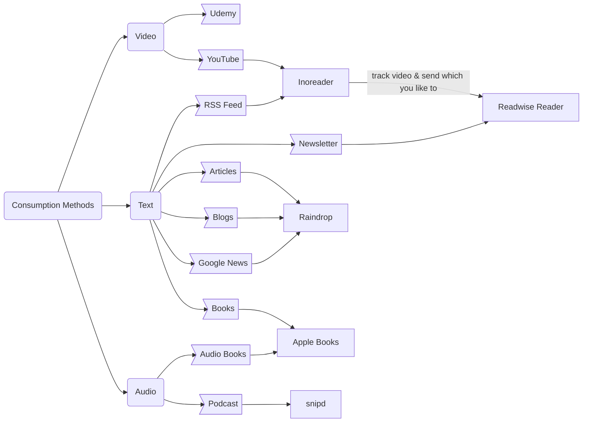

```mermaid

graph LR

%% Top Node
CM(Consumption Methods)

%% Methods


%% Type Of Media
V(Video)
T(Text)
A(Audio)

%% Media Sources
u>Udemy]
y>YouTube]

ne>Newsletter]
a>Articles]
b>Blogs]
bo>Books]
r>RSS Feed]
n>Google News]

ab>Audio Books]
p>Podcast]

%% Second Brain
RR[Readwise Reader]
Io[Inoreader]
R[Raindrop]
AB[Apple Books]

%% 1. Consumption -> Type Of Media (0->1)
CM --> V & T & A

%% 2. Type Of Media -> Media Sources (1->2)
V --> u & y
T --> ne & a & b & bo & r & n
A --> ab & p

%% 3. Media Sources -> Second Brain (2->3) (using Methods)

y & r --> Io -- track video & send which you like to --> RR
ne --> RR
a & b & n --> R
bo & ab --> AB
p --> snipd


class RR,Io,R,AB internal-link;

```